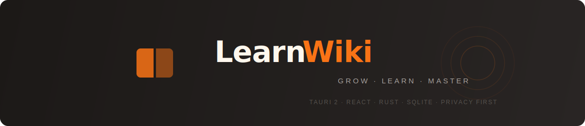

<p align="center">
  
</p>

<p align="center">
  <a href="https://github.com/kdsz001/LearnWiki/blob/main/LICENSE"></a>
  <a href="https://github.com/kdsz001/LearnWiki/releases"></a>
  
  
</p>

<p align="center">
  Your personal growth companion — capture knowledge, build understanding, master what you learn<br>
  <b>From scattered information to structured mastery.</b>
  <b>Base on OpenWiKi https://github.com/kdsz001/OpenWiki.</b>
</p>

<p align="center">
  🌱 Plan your goals · 📖 Build knowledge · 🧠 Review with spaced repetition · ✅ Test and master<br>
  Privacy first — all data stored locally. You own your learning journey.
</p>

<p align="center">
  <a href="README.zh-CN.md">中文文档</a>
</p>

## Features

### 📋 Capture Popup

- A popup appears on your desktop when you copy something (auto-dismisses after 10 seconds)
- **Only content you actively choose to keep gets saved** — no silent hoarding
- Supports text, images, and URLs with automatic source app detection
- Fetches full article content from WeChat, X/Twitter, and other URLs
- `⌘⇧C` on macOS or `Ctrl+Shift+C` on Windows to manually trigger the capture window

### 📂 Content Management

- Filter by type (text / image / link) and time range
- Global search across content and knowledge base
- Calendar timeline view — browse history by day
- One-click export to Markdown

### 🧠 AI Knowledge Base

- AI automatically compiles captured content into Wiki pages (concepts, entities, topics)
- Knowledge graph visualization — see how ideas connect
- **Ask sidebar** — ask questions about your knowledge base, AI answers based on your content
- Auto-detect orphaned pages, broken links, and structural issues

### 📚 Learning System

> **Plan → Read → Review → Test → Master**

- **Goal-driven learning** — set what you want to master, AI auto-links relevant knowledge points
- **Spaced repetition** — SM-2 algorithm schedules reviews at optimal intervals (1 day → 3 days → 7 days → ...)
- **Multiple-choice quizzes** — AI generates 4-question quizzes per knowledge point, instant scoring with explanations
- **Exam system** — comprehensive tests with customizable question types (choice / true-false / essay), auto-grading
- **Learning trail** — track mastery, review history, and exam performance per knowledge point
- **Knowledge health** — visual dashboard showing what needs review and what's mastered

### 📊 Insight Reports

- One-click AI weekly report summarizing captured content
- **Attention analysis** — 7-dimension insights into your information habits:
  - At a Glance / Subconscious / Graveyard / Blind Spots / Hot Topics / Heatmap / Action Items
- Like or dismiss report items — AI learns your preferences

### ⚙️ AI Providers

- Supports **Anthropic (Claude)** / **OpenAI** / **Google Gemini**
- API Key or OAuth login — two ways to connect
- Choose different models for each provider

### 🖥 Desktop Experience

- System tray — closing the window keeps the app running
- `⌘⇧Y` on macOS or `Ctrl+Shift+Y` on Windows to show the main window
- Dark / Light / System theme
- MCP protocol integration — connect to Claude Desktop

## Download

TBC

### ⚠️ First Launch Guide (Important)

Choose the steps for your operating system.

#### macOS

The app is not signed with an Apple Developer certificate, so macOS may block it:

1. Open the `.dmg` and drag LearnWiki into the Applications folder
2. **Open Terminal and run `xattr -cr /Applications/LearnWiki.app`** to allow the app to run
3. Launch the app and click "Allow" in the authorization prompt
4. Go to Settings → AI to configure your AI provider

#### Windows

The Windows build is unsigned, so Microsoft Defender SmartScreen may warn on first launch:

1. Run `LearnWiki_X.Y.Z_x64-setup.exe`
2. If SmartScreen appears, choose **More info** → **Run anyway**
3. Launch LearnWiki from the Start menu or desktop shortcut
4. Go to Settings → AI to configure your AI provider

### Optional Dependencies

These features require additional tools. Other features work without them:

| Feature                     | Requires         | Install                                                  |
| --------------------------- | ---------------- | -------------------------------------------------------- |
| YouTube subtitle extraction | yt-dlp + Node.js | `pip3 install yt-dlp` + [nodejs.org](https://nodejs.org) |

## Development

### Prerequisites

- Node.js 18+
- Rust (latest stable)
- macOS 13+ or Windows 10/11
- macOS: Xcode Command Line Tools (`xcode-select --install`)
- Windows: Microsoft C++ Build Tools / Visual Studio Build Tools and WebView2 Runtime

### Getting Started

```bash
# Clone the repo
git clone https://github.com/yawin/LearnWiKi.git
cd LearnWiki

# Install dependencies
npm install

# Development mode
npm run tauri dev

# Build the app
npm run tauri build
```

Before creating release bundles, prepare the bundled document converter:

```bash
# macOS / Linux
./src-tauri/scripts/setup_markitdown.sh

# Windows PowerShell
./src-tauri/scripts/setup_markitdown.ps1
```

## Contributing

Contributions welcome! Read [CONTRIBUTING.md](CONTRIBUTING.md) for development workflow and guidelines.

## Acknowledgments

- [Andrej Karpathy](https://github.com/karpathy) — his [LLM Wiki idea](https://gist.github.com/karpathy/442a6bf555914893e9891c11519de94f) inspired the knowledge base design
- [yt-dlp](https://github.com/yt-dlp/yt-dlp) — YouTube subtitle extraction

## Special Thanks

Thanks to everyone who helped spread the word:

- [@NFTCPS](https://x.com/NFTCPS)

## Author

**Ray** — [@BitcoinRui](https://x.com/BitcoinRui)

## License

[MIT](LICENSE)

## Star History

[](https://www.star-history.com/#kdsz001/LearnWiki&type=date&legend=top-left)
