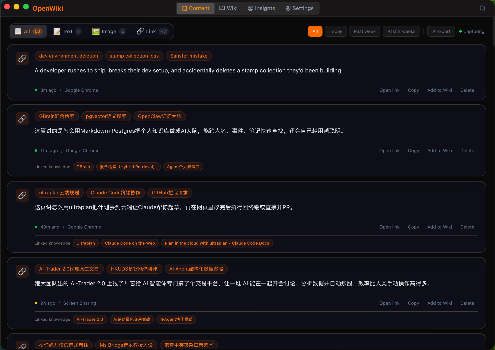
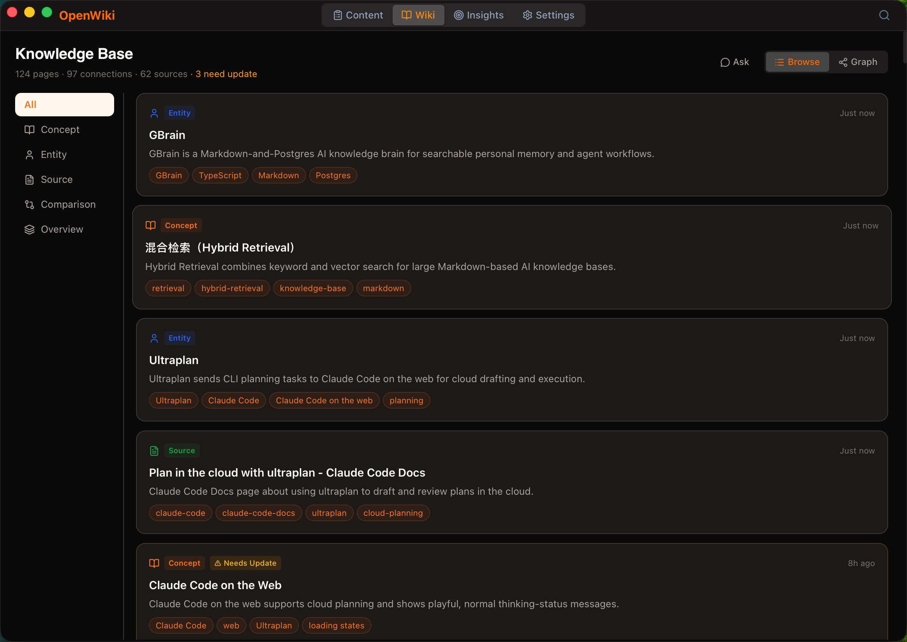
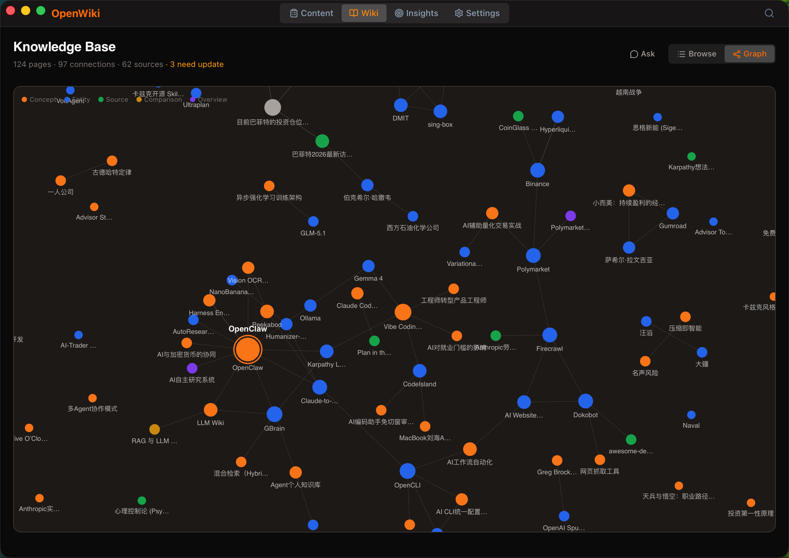
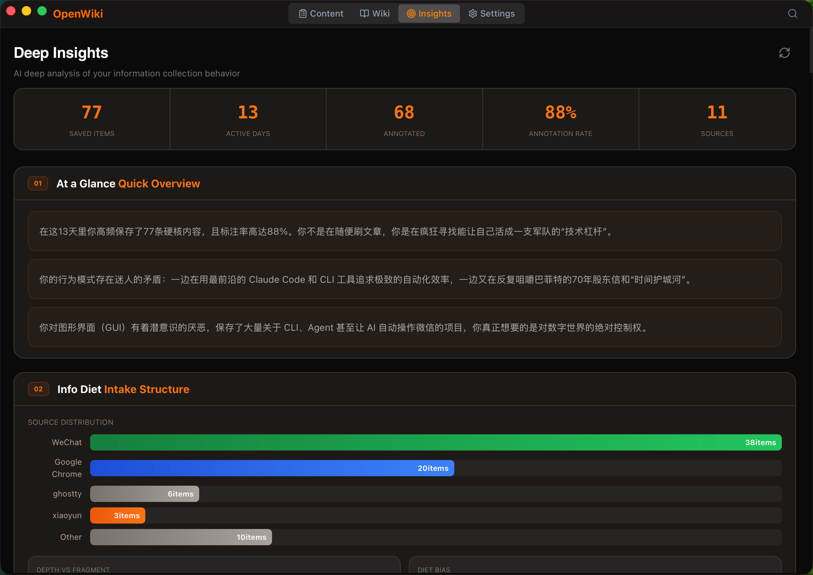

<p align="center">
  
</p>

<p align="center">
  <a href="https://github.com/kdsz001/LearnWiki/blob/main/LICENSE"></a>
  <a href="https://github.com/kdsz001/LearnWiki/releases"></a>
  
  
</p>

<p align="center">
  复制任何内容 → 桌面弹出浮窗 → 选择收藏 → AI 自动整理成知识库<br>
  <b>你决定留什么，AI 帮你理清楚。</b>
</p>

<p align="center">
  隐私优先 — 所有数据存储在本地 SQLite 数据库。
</p>

## 📸 截图

| 内容捕获 | 知识库 |
|:---:|:---:|
|  |  |

| 知识图谱 | 深度洞察 |
|:---:|:---:|
|  |  |

## 核心功能

### 📋 捕获浮窗
- 复制内容时桌面弹出浮窗（默认 10 秒后消失）
- **只有你主动选择收藏的内容才会保存**，不会偷偷囤积
- 支持文本、图片、URL，自动识别来源应用
- 支持抓取微信公众号、X/Twitter 等 URL 的正文内容
- macOS 使用 `⌘⇧C`、Windows 使用 `Ctrl+Shift+C` 可随时手动呼出捕获窗口

### 📂 内容管理
- 按类型（文本 / 图片 / 链接）和时间范围过滤
- 全局搜索，跨内容和知识库同时检索
- 日历时间线视图，按天浏览历史
- 一键导出为 Markdown 文件

### 🧠 AI 知识库
- AI 自动将捕获内容编译为 Wiki 页面（概念、实体、主题）
- 知识图谱可视化，看见概念之间的关联
- **Ask 侧栏** — 向你的知识库提问，AI 基于你的内容回答
- 自动检测孤立页面、断裂链接等结构问题

### 📊 洞察报告
- 一键生成 AI 周报，汇总本周捕获内容
- **注意力分析** — 7 维度洞察你的信息习惯：
    - 一瞥总览 / 潜意识 / 遗忘墓地 / 盲区 / 热点 / 热力图 / 行动建议
- 对报告内容点赞或忽略，AI 学习你的偏好

### ⚙️ AI 提供商
- 支持 **Anthropic (Claude)** / **OpenAI** / **Google Gemini**
- API Key 或 OAuth 登录，两种接入方式
- 可为每个提供商选择不同模型

### 🖥 桌面体验
- 系统托盘常驻，关闭窗口不退出
- macOS 使用 `⌘⇧Y`、Windows 使用 `Ctrl+Shift+Y` 唤起主窗口
- 深色 / 浅色 / 跟随系统主题
- MCP 协议集成，可连接 Claude Desktop

## 下载安装

- macOS (Apple Silicon): 下载下方的 `LearnWiki_X.Y.Z_aarch64.dmg`
- macOS (Intel): 下载下方的 `LearnWiki_X.Y.Z_x64.dmg`
- Windows (x64): 下载 `LearnWiki_X.Y.Z_x64-setup.exe`（推荐）或 `LearnWiki_X.Y.Z_x64_en-US.msi`

👉 [前往 Release 页面下载](https://github.com/kdsz001/LearnWiki/releases)

### ⚠️ 首次打开指南（重要）

请根据你的系统选择对应步骤。

#### macOS

由于应用未经 Apple 签名，macOS 可能会拦截：

1. 打开 `.dmg`，将 LearnWiki 拖入「应用程序」文件夹
2. **打开终端，执行 `xattr -cr /Applications/LearnWiki.app` ，允许应用运行**
3. 运行应用，在弹出的授权窗口点击“允许”
4. 在应用的“设置”->“AI”中配置 AI 提供商信息

#### Windows

Windows 版本暂未进行代码签名，首次运行时 Microsoft Defender SmartScreen 可能会提示风险：

1. 运行 `LearnWiki_X.Y.Z_x64-setup.exe`
2. 如果出现 SmartScreen 提示，点击“更多信息”->“仍要运行”
3. 从开始菜单或桌面快捷方式启动 LearnWiki
4. 在应用的“设置”->“AI”中配置 AI 提供商信息

### 已知的外部依赖

以下功能需要额外安装工具，不影响其他功能使用：

| 功能 | 需要安装 | 安装方式 |
|---|---|---|
| YouTube 字幕抓取 | yt-dlp + Node.js | `pip3 install yt-dlp` + [nodejs.org](https://nodejs.org) |

## 开发指南

### 前置要求
- Node.js 18+
- Rust (最新 stable)
- macOS 13+ 或 Windows 10/11
- macOS: Xcode Command Line Tools （终端运行 `xcode-select --install`）
- Windows: Microsoft C++ Build Tools / Visual Studio Build Tools 和 WebView2 Runtime

### 开始

```bash
# 克隆仓库
git clone https://github.com/kdsz001/LearnWiki.git
cd LearnWiki

# 安装依赖
npm install

# 开发模式
npm run tauri dev

# 构建应用
npm run tauri build
```

创建正式安装包前，需要先准备内置文档转换器：

```bash
# macOS / Linux
./src-tauri/scripts/setup_markitdown.sh

# Windows PowerShell
./src-tauri/scripts/setup_markitdown.ps1
```

## 参与贡献

欢迎贡献！请阅读 [CONTRIBUTING.md](CONTRIBUTING.md) 了解开发流程和规范。

## 致谢

- [Andrej Karpathy](https://github.com/karpathy) — 他的 [LLM Wiki 构想](https://gist.github.com/karpathy/442a6bf555914893e9891c11519de94f) 启发了知识库的设计
- [yt-dlp](https://github.com/yt-dlp/yt-dlp) — YouTube 字幕提取

## 特别鸣谢

感谢每一位帮忙传播 LearnWiki 的朋友：

- [@NFTCPS](https://x.com/NFTCPS)

## 作者

**Ray** — [@BitcoinRui](https://x.com/BitcoinRui)

## License

[MIT](LICENSE)

## Star History

[](https://www.star-history.com/#kdsz001/LearnWiki&type=date&legend=top-left)
